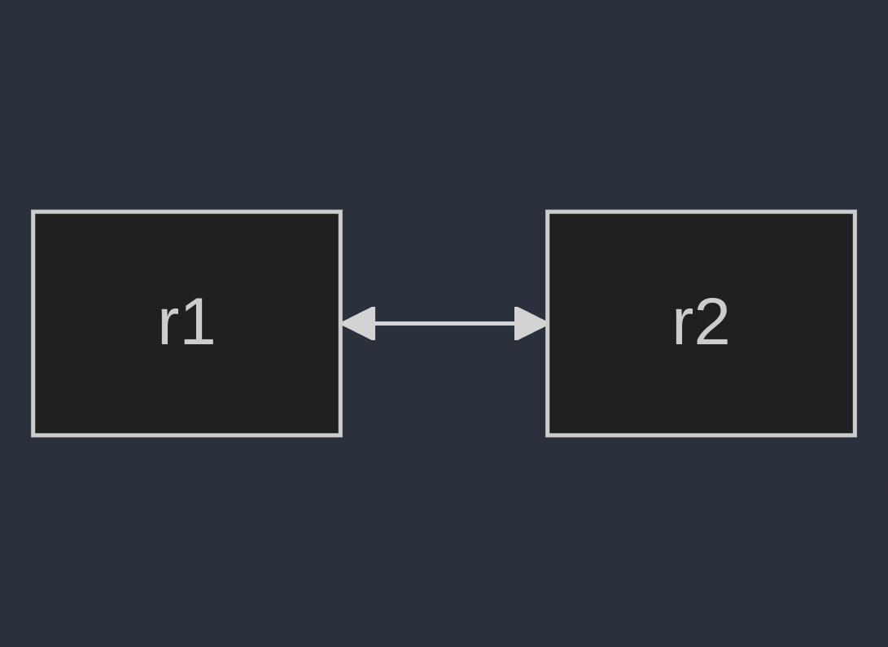

# Routing - OSPF

- Originally defined in [RFC 2328](https://www.ietf.org/rfc/rfc2328.txt)
- Link-state routing protocol
- Leverages multicast addresses 224.0.0.5 and 224.0.0.6

---

# Lab Topology

- Two Arista EOS nodes
- The goal is to get a basic OSPF adjacency between both nodes

    

---

# Enable Routing

## r1 & r2

```shell
ip routing
```

---

# Enable OSPF

## r1 & r2

```shell
router ospf 1
```

---

# Set the  Router ID


## r1

```shell
!r1
router ospf 1
router-id 10.0.0.1
```

## r2

```shell
!r2
router ospf 1
router-id 10.0.0.2
```

---

# Configure Ethernet1 For Both Nodes

- Both nodes are connected through Ethernet1
- Configure both interfaces so they may reach each other (your choice on the network)

## r1

```shell
interface Ethernet1
no switchport
ip address 10.0.0.1/24
```

## r2

```shell
interface Ethernet1
no switchport
ip address 10.0.0.2/24
```

---

# Test connectivity

This example is from r1

```shell
r1#ping 10.0.0.2
PING 10.0.0.2 (10.0.0.2) 72(100) bytes of data.

--- 10.0.0.2 ping statistics ---
5 packets transmitted, 0 received, 100% packet loss, time 40ms

r1#ping 10.0.0.2
PING 10.0.0.2 (10.0.0.2) 72(100) bytes of data.
80 bytes from 10.0.0.2: icmp_seq=1 ttl=64 time=0.115 ms
80 bytes from 10.0.0.2: icmp_seq=2 ttl=64 time=0.021 ms
80 bytes from 10.0.0.2: icmp_seq=3 ttl=64 time=0.017 ms
80 bytes from 10.0.0.2: icmp_seq=4 ttl=64 time=0.017 ms
80 bytes from 10.0.0.2: icmp_seq=5 ttl=64 time=0.016 ms

--- 10.0.0.2 ping statistics ---
5 packets transmitted, 5 received, 0% packet loss, time 0ms
rtt min/avg/max/mdev = 0.016/0.037/0.115/0.038 ms, ipg/ewma 0.069/0.074 ms
r1#
```

---

# Enable OSPF on Each Interface

## r1 & r2

```shell
interface Ethernet1
ip ospf network point-to-point
ip ospf area 0.0.0.0
```

---

# Check the Adjacency

## Either Node

```shell
r1#show ip ospf neighbor 
Neighbor ID     Instance VRF      Pri State                  Dead Time   Address         Interface
10.0.0.1        1        default  0   FULL                   00:00:35    10.0.0.2        Ethernet1
r1#
```

---

# Advertise a new route

For this exercise we will add a loopback 0 interface on either node and advertise this under OSPF Area 1.

```shell
interface Loopback1
ip address 10.1.1.1/32
ip ospf area 0.0.0.1
```

---

# Check the Route

```shell
r2#show ip route | b Gate
Gateway of last resort is not set

 C        10.0.0.0/24
           directly connected, Ethernet1
 O IA     10.1.1.1/32 [110/20]
           via 10.0.0.1, Ethernet1
```

---

# Bonus

Disable OSPF advertisements on all interfaces besides the two `Ethernet1` interfaces (both nodes)

```shell
router ospf 1
passive-interface default
no passive-interface Ethernet1
```